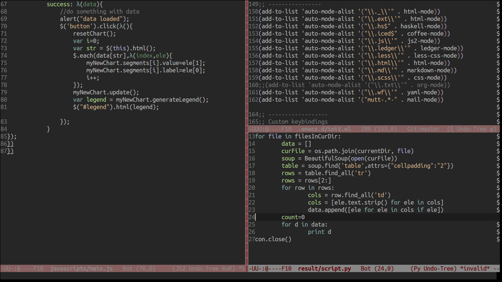

## My emacs configuration
Author : Jaseem Abid <jaseemabid@gmail.com>

Edited by : Araj P Raju <arajparaj@gmail.com>

Emacs configuration files rebuild for Emacs 24.

### Screenshot



### Instructions

Backup your existing emacs config as this will replace it.

```sh
    # Backup existing files
    cd ~/
	mv .emacs .emacs.backup
	mv .emacs.d .emacs.d.backup

	# Clone the repo to ~/.emacs.d
	git clone https://github.com/arajparaj/emacs.d.git .emacs.d

	# Fire up your emacs
	# All packages in elpa-list.el will be  installed automatically
	# Restart emacs
```
## License

The MIT License (MIT)
